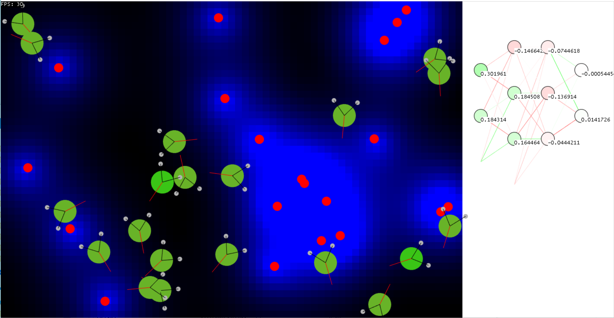

# Fishbowl
Fishbowl is simulation where organisms controlled by neural nets evolve behavior over generations.

The fishbowl environment is populated with food particles (red dots) which give off a scent (represented with blue). 
The organismns can detect the scent sterioscopically with each of their two antennae. This information, along with their 
current level of fullness (represented by their body color form green to brown), form the inputs to a configurable neural
network "brain". The outputs of this network are the control inputs for the organism.

At the end of each generation, the surviving organisms "breed". Their network weights and biases are encoded into genomes and 
then genomes are combined in a way that mimics sexual reproduction (with crossover, mutation, etc).

Over generations, the organisms develop strategies for efficiently seeking out food.

